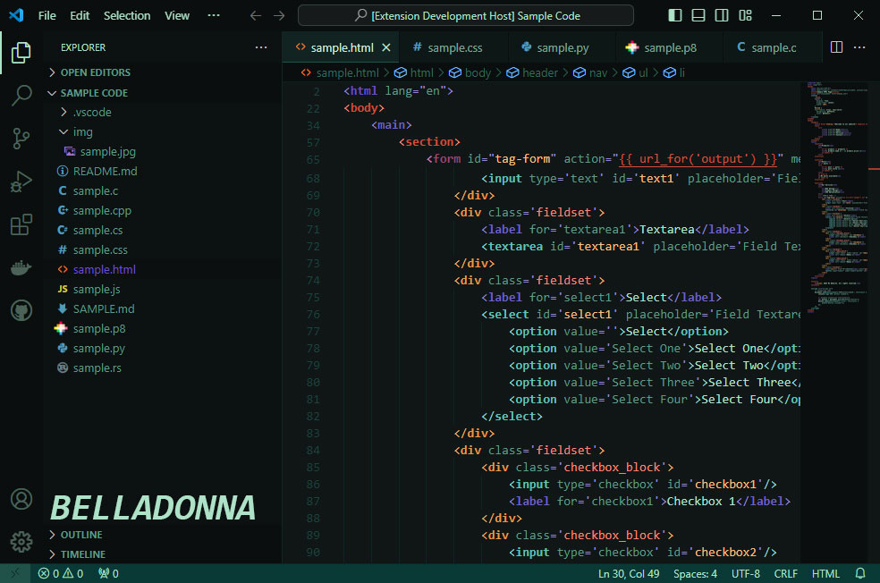
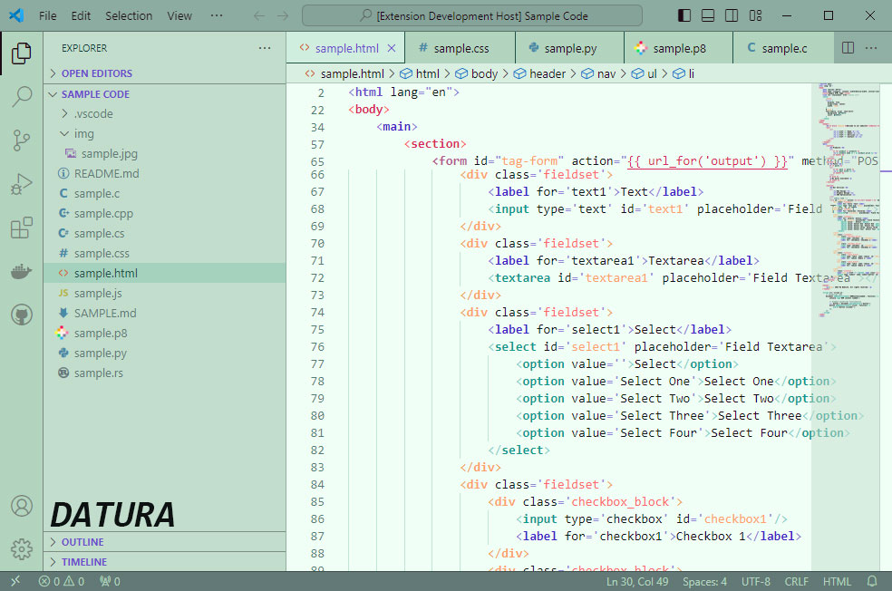
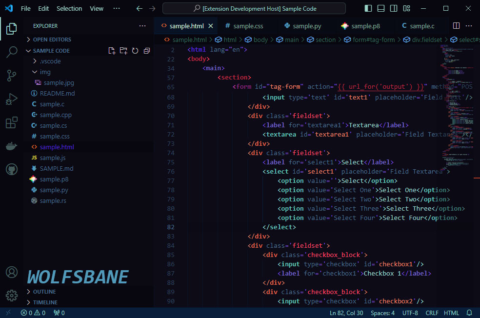

# Nightshade VS Code Theme

Collection of themes for for Visual Studio Code

## Belladonna
Green-forward dark theme 

## Datura
Soft green light theme

## Wolfsbane
Midnight blue theme

 

## Programming Language Syntax Highlighting Support
- Generic support for all languages
- HTML / CSS / JS
- Python
- C / C++
- LUA / PICO-8

### Current Planned Support
- React 
- GO
- Rust
- C#
- Java
- GDScript

If you want support for a specific language or run into a problem, submit a [feature request or ticket](https://github.com/cheesepak/nightshade-theme-vscode/issues) on the [Nightshade Github](https://github.com/cheesepak/nightshade-theme-vscode) page.